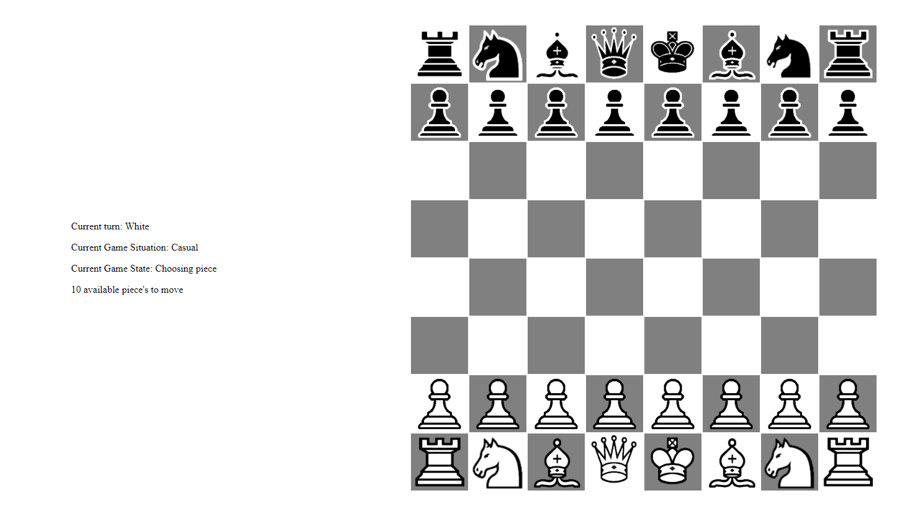

# Prototype local chess Chess game



<br>

### How to use:

---

- Download or clone the repository

```
git clone https://github.com/arenJ1nbachian/Chess.git
```

-Go to the directory
-Run the chess.html file
-Start playing
